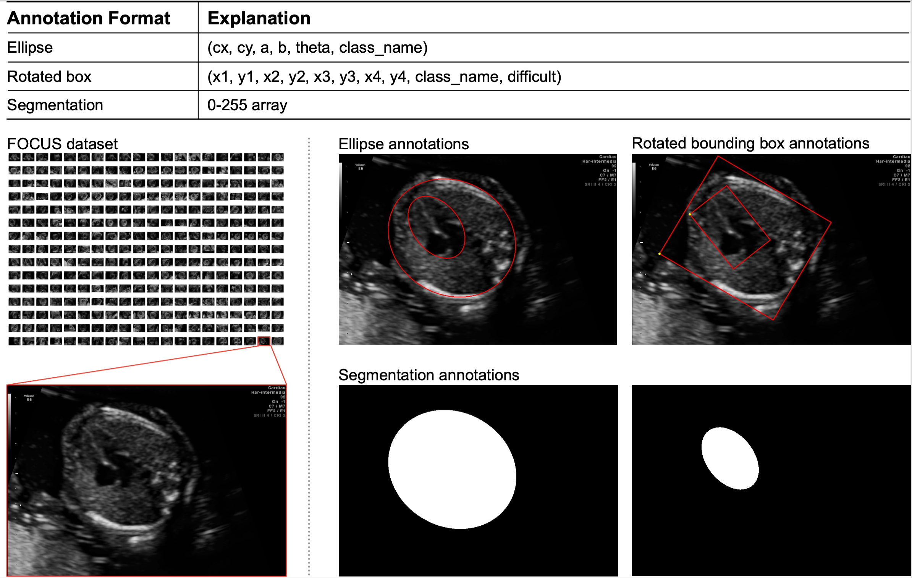

# 
FOCUS: Four-chamber Ultrasound Image Dataset for Fetal Cardiac Biometric Measurement 

This repository accompanies the FOCUS database, a publicly available dataset of cardiac biometric measurement for fetal
ultrasound images.
It includes object-level annotations for all original resolutions, detailed measurement metrics,
and associated baseline models for technical validation.

## Dataset & Annotations

This dataset is an extensive and well-annotated set of fetal four-chamber ultrasound images, sourced from public FETAL_PLANE database.
Our dataset comprises 300 images from 217 patients and is the first to incorporate ellipse annotations for both cardiac and thoracic regions across all cases.
Besides,
we also present the corresponding rotation box annotation (DOTA format), and segmented mask annotation for each case.
example image from the dataset.
To access the dataset, please visit the following Zenodo repo:
[https://zenodo.org/records/14597550](https://zenodo.org/records/14597550).

## Technical Validation

|         Methods          | Cardiac: DSC (%) ↑  | Cardiac: HD95 (pixel) ↓  | Thoracic: DSC (%) ↑  | Thoracic: HD95 (pixel) ↓  | Biometric: CTR (%) ↑ |              Paper & Code                                                                                         |
|:------------------------:|:-------------------:|:---------------------:|:--------------------:|:---------------------:|:---------------------:|:-----------------------------------------------------------------------------------------------------------------:|
|          U-Net           |    89.12 ± 1.62     |     25.63 ± 4.24      |     93.96 ± 0.67     |     32.74 ± 4.68      |     90.23 ± 1.37      |          [[Paper]](https://arxiv.org/abs/1505.04597) [[Code]](https://github.com/milesial/Pytorch-UNet)           |   
|        TransUNet         |    92.48 ± 0.36     |     16.76 ± 0.72      |     96.48 ± 0.18     |     16.26 ± 0.96      |     93.32 ± 1.38      |           [[Paper]](https://arxiv.org/abs/2102.04306) [[Code]](https://github.com/Beckschen/TransUNet)            |
|      Oriented R-CNN      |    60.00 ± 3.10     |    109.96 ± 10.06     |     69.42 ± 5.25     |    140.57 ± 27.50     |     61.94 ± 11.83     |          [[Paper]](https://arxiv.org/abs/2108.05699) [[Code]](https://github.com/open-mmlab/mmdetection)          |
|   Rotated Faster R-CNN   |    86.60 ± 0.72     |     27.97 ± 1.28      |     91.00 ± 0.94     |     39.82 ± 4.60      |     88.30 ± 1.63      | [[Paper]](https://dl.acm.org/doi/abs/10.1145/3402597.3402605) [[Code]](https://github.com/open-mmlab/mmdetection) |

[!Note]: Oriented R-CNN and Rotated Faster RCNN experiments are based on the implementation of the MMRotate framework.
MMRotate depends on [PyTorch](https://pytorch.org/), [MMCV](https://github.com/open-mmlab/mmcv) and [MMDetection](https://github.com/open-mmlab/mmdetection).
Please refer to [Install Guide](https://mmrotate.readthedocs.io/en/latest/install.html) for more detailed instruction.

## Toolkit

The code in this repository is organized into different files:

| File                                 | Description                                                                                                                                                                           |
|:-------------------------------------|:--------------------------------------------------------------------------------------------------------------------------------------------------------------------------------------| 
| `toolkit/calculate_metric_result.py` | Calculate deep model prediction metrics, including Dice similarity coefficient (DSC) and 95th percentile Hausdorff distance (HD95) and cardiothoracic diameter ratio (CTR) biometric. |
| `toolkit/plot_ellipse_result.py`     | Plot the ellipses prediction on the image using different colors.                                                                                                                     | 

## Citation
It would be highly appreciated if you cite our paper when using this dataset or code:

